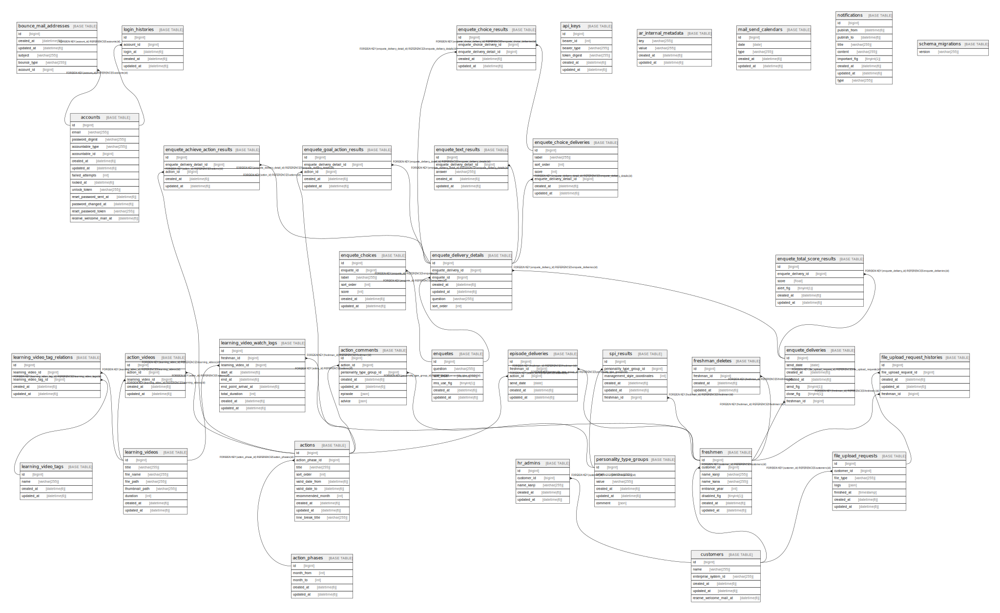

# nalachan_development

## Tables

| Name | Columns | Comment | Type |
| ---- | ------- | ------- | ---- |
| [accounts](accounts.md) | 14 |  | BASE TABLE |
| [action_comments](action_comments.md) | 7 |  | BASE TABLE |
| [action_phases](action_phases.md) | 5 |  | BASE TABLE |
| [action_videos](action_videos.md) | 5 |  | BASE TABLE |
| [actions](actions.md) | 10 |  | BASE TABLE |
| [api_keys](api_keys.md) | 6 |  | BASE TABLE |
| [ar_internal_metadata](ar_internal_metadata.md) | 4 |  | BASE TABLE |
| [bounce_mail_addresses](bounce_mail_addresses.md) | 6 |  | BASE TABLE |
| [customers](customers.md) | 6 |  | BASE TABLE |
| [enquete_achieve_action_results](enquete_achieve_action_results.md) | 5 |  | BASE TABLE |
| [enquete_choice_deliveries](enquete_choice_deliveries.md) | 7 |  | BASE TABLE |
| [enquete_choice_results](enquete_choice_results.md) | 5 |  | BASE TABLE |
| [enquete_choices](enquete_choices.md) | 7 |  | BASE TABLE |
| [enquete_deliveries](enquete_deliveries.md) | 7 |  | BASE TABLE |
| [enquete_delivery_details](enquete_delivery_details.md) | 7 |  | BASE TABLE |
| [enquete_goal_action_results](enquete_goal_action_results.md) | 5 |  | BASE TABLE |
| [enquete_text_results](enquete_text_results.md) | 5 |  | BASE TABLE |
| [enquete_total_score_results](enquete_total_score_results.md) | 6 |  | BASE TABLE |
| [enquetes](enquetes.md) | 6 |  | BASE TABLE |
| [episode_deliveries](episode_deliveries.md) | 6 |  | BASE TABLE |
| [file_upload_request_histories](file_upload_request_histories.md) | 5 |  | BASE TABLE |
| [file_upload_requests](file_upload_requests.md) | 7 |  | BASE TABLE |
| [freshman_deletes](freshman_deletes.md) | 4 |  | BASE TABLE |
| [freshmen](freshmen.md) | 8 |  | BASE TABLE |
| [hr_admins](hr_admins.md) | 5 |  | BASE TABLE |
| [learning_video_tag_relations](learning_video_tag_relations.md) | 5 |  | BASE TABLE |
| [learning_video_tags](learning_video_tags.md) | 4 |  | BASE TABLE |
| [learning_video_watch_logs](learning_video_watch_logs.md) | 9 |  | BASE TABLE |
| [learning_videos](learning_videos.md) | 8 |  | BASE TABLE |
| [login_histories](login_histories.md) | 5 |  | BASE TABLE |
| [mail_send_calendars](mail_send_calendars.md) | 5 |  | BASE TABLE |
| [notifications](notifications.md) | 9 |  | BASE TABLE |
| [personality_type_groups](personality_type_groups.md) | 6 |  | BASE TABLE |
| [schema_migrations](schema_migrations.md) | 1 |  | BASE TABLE |
| [spi_results](spi_results.md) | 6 |  | BASE TABLE |

## Relations

---

> Generated by [tbls](https://github.com/k1LoW/tbls)
