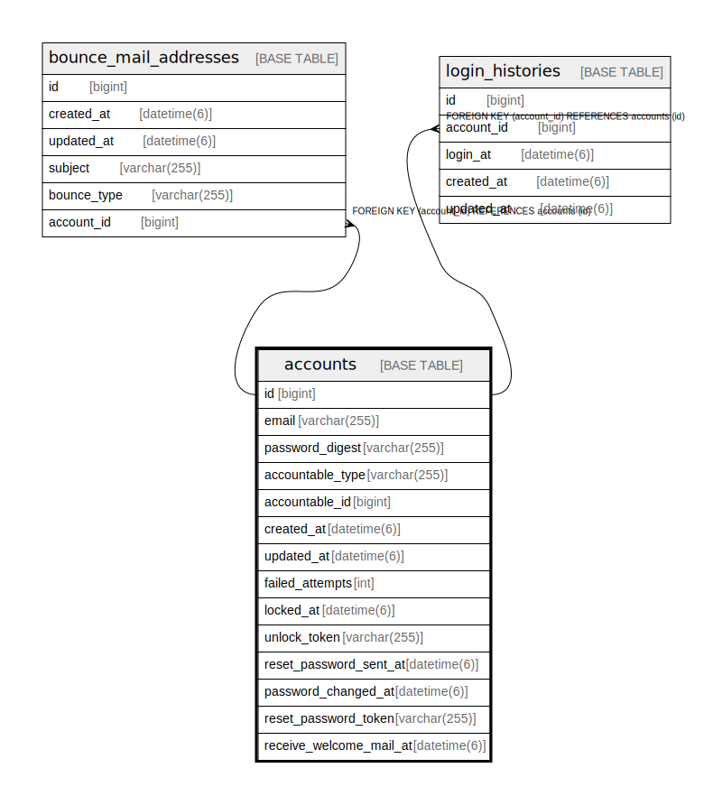

# accounts

## Description

<details>
<summary><strong>Table Definition</strong></summary>

```sql
CREATE TABLE `accounts` (
  `id` bigint NOT NULL AUTO_INCREMENT,
  `email` varchar(255) COLLATE utf8mb4_bin DEFAULT NULL,
  `password_digest` varchar(255) COLLATE utf8mb4_bin DEFAULT NULL,
  `accountable_type` varchar(255) COLLATE utf8mb4_bin DEFAULT NULL,
  `accountable_id` bigint DEFAULT NULL,
  `created_at` datetime(6) NOT NULL,
  `updated_at` datetime(6) NOT NULL,
  `failed_attempts` int NOT NULL DEFAULT '0',
  `locked_at` datetime(6) DEFAULT NULL,
  `unlock_token` varchar(255) COLLATE utf8mb4_bin DEFAULT NULL,
  `reset_password_sent_at` datetime(6) DEFAULT NULL,
  `password_changed_at` datetime(6) DEFAULT NULL,
  `reset_password_token` varchar(255) COLLATE utf8mb4_bin DEFAULT NULL,
  `receive_welcome_mail_at` datetime(6) DEFAULT NULL,
  PRIMARY KEY (`id`),
  UNIQUE KEY `index_accounts_on_email` (`email`),
  KEY `index_accounts_on_accountable` (`accountable_type`,`accountable_id`)
) ENGINE=InnoDB AUTO_INCREMENT=[Redacted by tbls] DEFAULT CHARSET=utf8mb4 COLLATE=utf8mb4_bin
```

</details>

## Columns

| Name | Type | Default | Nullable | Extra Definition | Children | Parents | Comment |
| ---- | ---- | ------- | -------- | ---------------- | -------- | ------- | ------- |
| id | bigint |  | false | auto_increment | [bounce_mail_addresses](bounce_mail_addresses.md) [login_histories](login_histories.md) |  |  |
| email | varchar(255) |  | true |  |  |  |  |
| password_digest | varchar(255) |  | true |  |  |  |  |
| accountable_type | varchar(255) |  | true |  |  |  |  |
| accountable_id | bigint |  | true |  |  |  |  |
| created_at | datetime(6) |  | false |  |  |  |  |
| updated_at | datetime(6) |  | false |  |  |  |  |
| failed_attempts | int | 0 | false |  |  |  |  |
| locked_at | datetime(6) |  | true |  |  |  |  |
| unlock_token | varchar(255) |  | true |  |  |  |  |
| reset_password_sent_at | datetime(6) |  | true |  |  |  |  |
| password_changed_at | datetime(6) |  | true |  |  |  |  |
| reset_password_token | varchar(255) |  | true |  |  |  |  |
| receive_welcome_mail_at | datetime(6) |  | true |  |  |  |  |

## Constraints

| Name | Type | Definition |
| ---- | ---- | ---------- |
| index_accounts_on_email | UNIQUE | UNIQUE KEY index_accounts_on_email (email) |
| PRIMARY | PRIMARY KEY | PRIMARY KEY (id) |

## Indexes

| Name | Definition |
| ---- | ---------- |
| index_accounts_on_accountable | KEY index_accounts_on_accountable (accountable_type, accountable_id) USING BTREE |
| PRIMARY | PRIMARY KEY (id) USING BTREE |
| index_accounts_on_email | UNIQUE KEY index_accounts_on_email (email) USING BTREE |

## Relations



---

> Generated by [tbls](https://github.com/k1LoW/tbls)
