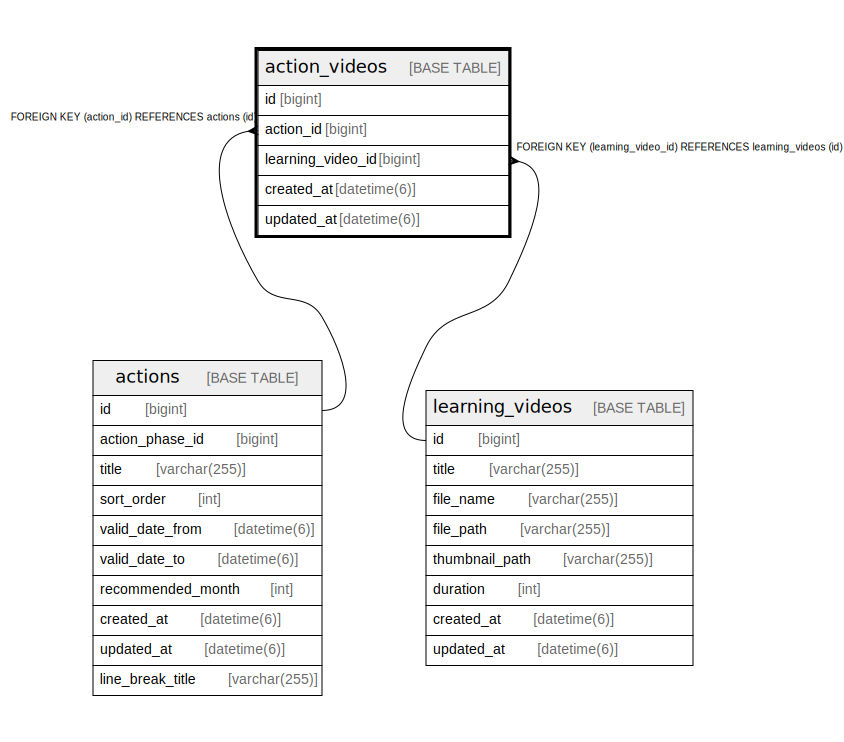

# action_videos

## Description

<details>
<summary><strong>Table Definition</strong></summary>

```sql
CREATE TABLE `action_videos` (
  `id` bigint NOT NULL AUTO_INCREMENT,
  `action_id` bigint NOT NULL,
  `learning_video_id` bigint NOT NULL,
  `created_at` datetime(6) NOT NULL,
  `updated_at` datetime(6) NOT NULL,
  PRIMARY KEY (`id`),
  KEY `index_action_videos_on_action_id` (`action_id`),
  KEY `index_action_videos_on_learning_video_id` (`learning_video_id`),
  CONSTRAINT `fk_rails_76413875a3` FOREIGN KEY (`action_id`) REFERENCES `actions` (`id`),
  CONSTRAINT `fk_rails_834cd10b90` FOREIGN KEY (`learning_video_id`) REFERENCES `learning_videos` (`id`)
) ENGINE=InnoDB AUTO_INCREMENT=[Redacted by tbls] DEFAULT CHARSET=utf8mb4 COLLATE=utf8mb4_bin
```

</details>

## Columns

| Name | Type | Default | Nullable | Extra Definition | Children | Parents | Comment |
| ---- | ---- | ------- | -------- | ---------------- | -------- | ------- | ------- |
| id | bigint |  | false | auto_increment |  |  |  |
| action_id | bigint |  | false |  |  | [actions](actions.md) |  |
| learning_video_id | bigint |  | false |  |  | [learning_videos](learning_videos.md) |  |
| created_at | datetime(6) |  | false |  |  |  |  |
| updated_at | datetime(6) |  | false |  |  |  |  |

## Constraints

| Name | Type | Definition |
| ---- | ---- | ---------- |
| fk_rails_76413875a3 | FOREIGN KEY | FOREIGN KEY (action_id) REFERENCES actions (id) |
| fk_rails_834cd10b90 | FOREIGN KEY | FOREIGN KEY (learning_video_id) REFERENCES learning_videos (id) |
| PRIMARY | PRIMARY KEY | PRIMARY KEY (id) |

## Indexes

| Name | Definition |
| ---- | ---------- |
| index_action_videos_on_action_id | KEY index_action_videos_on_action_id (action_id) USING BTREE |
| index_action_videos_on_learning_video_id | KEY index_action_videos_on_learning_video_id (learning_video_id) USING BTREE |
| PRIMARY | PRIMARY KEY (id) USING BTREE |

## Relations



---

> Generated by [tbls](https://github.com/k1LoW/tbls)
