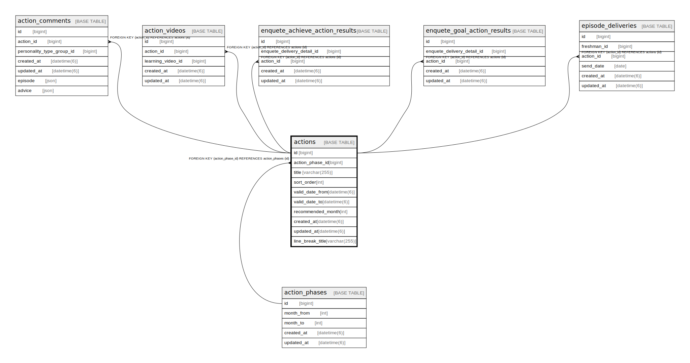

# actions

## Description

<details>
<summary><strong>Table Definition</strong></summary>

```sql
CREATE TABLE `actions` (
  `id` bigint NOT NULL AUTO_INCREMENT,
  `action_phase_id` bigint NOT NULL,
  `title` varchar(255) COLLATE utf8mb4_bin NOT NULL,
  `sort_order` int NOT NULL,
  `valid_date_from` datetime(6) NOT NULL,
  `valid_date_to` datetime(6) NOT NULL,
  `recommended_month` int DEFAULT NULL,
  `created_at` datetime(6) NOT NULL,
  `updated_at` datetime(6) NOT NULL,
  `line_break_title` varchar(255) COLLATE utf8mb4_bin NOT NULL,
  PRIMARY KEY (`id`),
  KEY `index_actions_on_action_phase_id` (`action_phase_id`),
  CONSTRAINT `fk_rails_3756a10323` FOREIGN KEY (`action_phase_id`) REFERENCES `action_phases` (`id`)
) ENGINE=InnoDB AUTO_INCREMENT=[Redacted by tbls] DEFAULT CHARSET=utf8mb4 COLLATE=utf8mb4_bin
```

</details>

## Columns

| Name | Type | Default | Nullable | Extra Definition | Children | Parents | Comment |
| ---- | ---- | ------- | -------- | ---------------- | -------- | ------- | ------- |
| id | bigint |  | false | auto_increment | [action_comments](action_comments.md) [action_videos](action_videos.md) [enquete_achieve_action_results](enquete_achieve_action_results.md) [enquete_goal_action_results](enquete_goal_action_results.md) [episode_deliveries](episode_deliveries.md) |  |  |
| action_phase_id | bigint |  | false |  |  | [action_phases](action_phases.md) |  |
| title | varchar(255) |  | false |  |  |  |  |
| sort_order | int |  | false |  |  |  |  |
| valid_date_from | datetime(6) |  | false |  |  |  |  |
| valid_date_to | datetime(6) |  | false |  |  |  |  |
| recommended_month | int |  | true |  |  |  |  |
| created_at | datetime(6) |  | false |  |  |  |  |
| updated_at | datetime(6) |  | false |  |  |  |  |
| line_break_title | varchar(255) |  | false |  |  |  |  |

## Constraints

| Name | Type | Definition |
| ---- | ---- | ---------- |
| fk_rails_3756a10323 | FOREIGN KEY | FOREIGN KEY (action_phase_id) REFERENCES action_phases (id) |
| PRIMARY | PRIMARY KEY | PRIMARY KEY (id) |

## Indexes

| Name | Definition |
| ---- | ---------- |
| index_actions_on_action_phase_id | KEY index_actions_on_action_phase_id (action_phase_id) USING BTREE |
| PRIMARY | PRIMARY KEY (id) USING BTREE |

## Relations



---

> Generated by [tbls](https://github.com/k1LoW/tbls)
