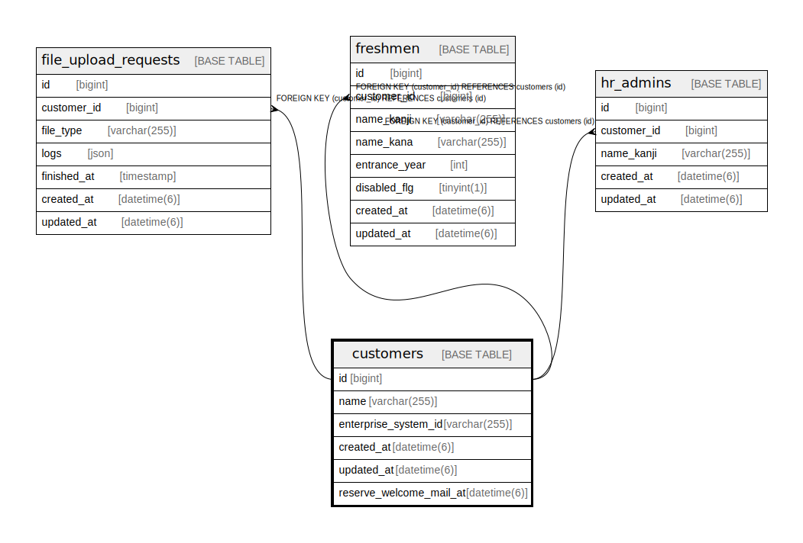

# customers

## Description

<details>
<summary><strong>Table Definition</strong></summary>

```sql
CREATE TABLE `customers` (
  `id` bigint NOT NULL AUTO_INCREMENT,
  `name` varchar(255) COLLATE utf8mb4_bin NOT NULL,
  `enterprise_system_id` varchar(255) COLLATE utf8mb4_bin NOT NULL,
  `created_at` datetime(6) NOT NULL,
  `updated_at` datetime(6) NOT NULL,
  `reserve_welcome_mail_at` datetime(6) DEFAULT NULL,
  PRIMARY KEY (`id`),
  UNIQUE KEY `index_customers_on_enterprise_system_id` (`enterprise_system_id`)
) ENGINE=InnoDB AUTO_INCREMENT=[Redacted by tbls] DEFAULT CHARSET=utf8mb4 COLLATE=utf8mb4_bin
```

</details>

## Columns

| Name | Type | Default | Nullable | Extra Definition | Children | Parents | Comment |
| ---- | ---- | ------- | -------- | ---------------- | -------- | ------- | ------- |
| id | bigint |  | false | auto_increment | [file_upload_requests](file_upload_requests.md) [freshmen](freshmen.md) [hr_admins](hr_admins.md) |  |  |
| name | varchar(255) |  | false |  |  |  |  |
| enterprise_system_id | varchar(255) |  | false |  |  |  |  |
| created_at | datetime(6) |  | false |  |  |  |  |
| updated_at | datetime(6) |  | false |  |  |  |  |
| reserve_welcome_mail_at | datetime(6) |  | true |  |  |  |  |

## Constraints

| Name | Type | Definition |
| ---- | ---- | ---------- |
| index_customers_on_enterprise_system_id | UNIQUE | UNIQUE KEY index_customers_on_enterprise_system_id (enterprise_system_id) |
| PRIMARY | PRIMARY KEY | PRIMARY KEY (id) |

## Indexes

| Name | Definition |
| ---- | ---------- |
| PRIMARY | PRIMARY KEY (id) USING BTREE |
| index_customers_on_enterprise_system_id | UNIQUE KEY index_customers_on_enterprise_system_id (enterprise_system_id) USING BTREE |

## Relations



---

> Generated by [tbls](https://github.com/k1LoW/tbls)
