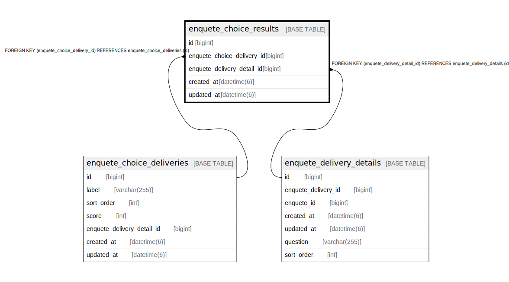

# enquete_choice_results

## Description

<details>
<summary><strong>Table Definition</strong></summary>

```sql
CREATE TABLE `enquete_choice_results` (
  `id` bigint NOT NULL AUTO_INCREMENT,
  `enquete_choice_delivery_id` bigint NOT NULL,
  `enquete_delivery_detail_id` bigint NOT NULL,
  `created_at` datetime(6) NOT NULL,
  `updated_at` datetime(6) NOT NULL,
  PRIMARY KEY (`id`),
  KEY `index_enquete_choice_results_on_enquete_choice_delivery_id` (`enquete_choice_delivery_id`),
  KEY `index_enquete_choice_results_on_enquete_delivery_detail_id` (`enquete_delivery_detail_id`),
  CONSTRAINT `fk_rails_3340a978a9` FOREIGN KEY (`enquete_choice_delivery_id`) REFERENCES `enquete_choice_deliveries` (`id`),
  CONSTRAINT `fk_rails_972e97f8e6` FOREIGN KEY (`enquete_delivery_detail_id`) REFERENCES `enquete_delivery_details` (`id`)
) ENGINE=InnoDB DEFAULT CHARSET=utf8mb4 COLLATE=utf8mb4_bin
```

</details>

## Columns

| Name | Type | Default | Nullable | Extra Definition | Children | Parents | Comment |
| ---- | ---- | ------- | -------- | ---------------- | -------- | ------- | ------- |
| id | bigint |  | false | auto_increment |  |  |  |
| enquete_choice_delivery_id | bigint |  | false |  |  | [enquete_choice_deliveries](enquete_choice_deliveries.md) |  |
| enquete_delivery_detail_id | bigint |  | false |  |  | [enquete_delivery_details](enquete_delivery_details.md) |  |
| created_at | datetime(6) |  | false |  |  |  |  |
| updated_at | datetime(6) |  | false |  |  |  |  |

## Constraints

| Name | Type | Definition |
| ---- | ---- | ---------- |
| fk_rails_3340a978a9 | FOREIGN KEY | FOREIGN KEY (enquete_choice_delivery_id) REFERENCES enquete_choice_deliveries (id) |
| fk_rails_972e97f8e6 | FOREIGN KEY | FOREIGN KEY (enquete_delivery_detail_id) REFERENCES enquete_delivery_details (id) |
| PRIMARY | PRIMARY KEY | PRIMARY KEY (id) |

## Indexes

| Name | Definition |
| ---- | ---------- |
| index_enquete_choice_results_on_enquete_choice_delivery_id | KEY index_enquete_choice_results_on_enquete_choice_delivery_id (enquete_choice_delivery_id) USING BTREE |
| index_enquete_choice_results_on_enquete_delivery_detail_id | KEY index_enquete_choice_results_on_enquete_delivery_detail_id (enquete_delivery_detail_id) USING BTREE |
| PRIMARY | PRIMARY KEY (id) USING BTREE |

## Relations



---

> Generated by [tbls](https://github.com/k1LoW/tbls)
