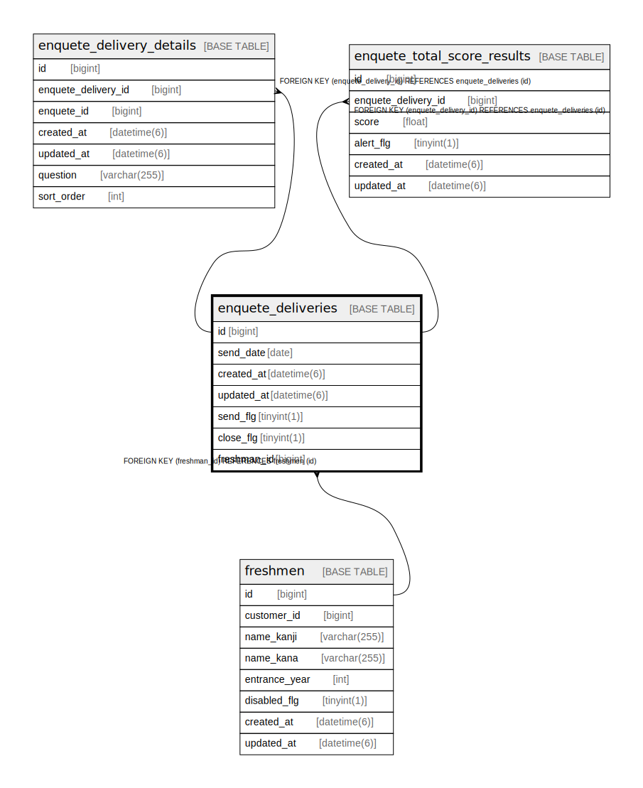

# enquete_deliveries

## Description

<details>
<summary><strong>Table Definition</strong></summary>

```sql
CREATE TABLE `enquete_deliveries` (
  `id` bigint NOT NULL AUTO_INCREMENT,
  `send_date` date NOT NULL,
  `created_at` datetime(6) NOT NULL,
  `updated_at` datetime(6) NOT NULL,
  `send_flg` tinyint(1) DEFAULT '0',
  `close_flg` tinyint(1) DEFAULT '0',
  `freshman_id` bigint DEFAULT NULL,
  PRIMARY KEY (`id`),
  UNIQUE KEY `index_enquete_deliveries_on_freshman_id_and_send_date` (`freshman_id`,`send_date`),
  KEY `index_enquete_deliveries_on_freshman_id` (`freshman_id`),
  CONSTRAINT `fk_rails_b196612158` FOREIGN KEY (`freshman_id`) REFERENCES `freshmen` (`id`)
) ENGINE=InnoDB AUTO_INCREMENT=[Redacted by tbls] DEFAULT CHARSET=utf8mb4 COLLATE=utf8mb4_bin
```

</details>

## Columns

| Name | Type | Default | Nullable | Extra Definition | Children | Parents | Comment |
| ---- | ---- | ------- | -------- | ---------------- | -------- | ------- | ------- |
| id | bigint |  | false | auto_increment | [enquete_delivery_details](enquete_delivery_details.md) [enquete_total_score_results](enquete_total_score_results.md) |  |  |
| send_date | date |  | false |  |  |  |  |
| created_at | datetime(6) |  | false |  |  |  |  |
| updated_at | datetime(6) |  | false |  |  |  |  |
| send_flg | tinyint(1) | 0 | true |  |  |  |  |
| close_flg | tinyint(1) | 0 | true |  |  |  |  |
| freshman_id | bigint |  | true |  |  | [freshmen](freshmen.md) |  |

## Constraints

| Name | Type | Definition |
| ---- | ---- | ---------- |
| fk_rails_b196612158 | FOREIGN KEY | FOREIGN KEY (freshman_id) REFERENCES freshmen (id) |
| index_enquete_deliveries_on_freshman_id_and_send_date | UNIQUE | UNIQUE KEY index_enquete_deliveries_on_freshman_id_and_send_date (freshman_id, send_date) |
| PRIMARY | PRIMARY KEY | PRIMARY KEY (id) |

## Indexes

| Name | Definition |
| ---- | ---------- |
| index_enquete_deliveries_on_freshman_id | KEY index_enquete_deliveries_on_freshman_id (freshman_id) USING BTREE |
| PRIMARY | PRIMARY KEY (id) USING BTREE |
| index_enquete_deliveries_on_freshman_id_and_send_date | UNIQUE KEY index_enquete_deliveries_on_freshman_id_and_send_date (freshman_id, send_date) USING BTREE |

## Relations



---

> Generated by [tbls](https://github.com/k1LoW/tbls)
