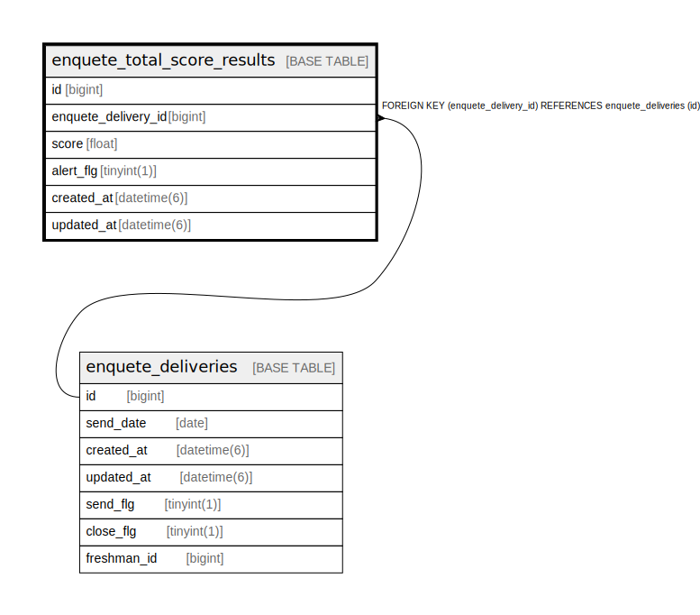

# enquete_total_score_results

## Description

<details>
<summary><strong>Table Definition</strong></summary>

```sql
CREATE TABLE `enquete_total_score_results` (
  `id` bigint NOT NULL AUTO_INCREMENT,
  `enquete_delivery_id` bigint NOT NULL,
  `score` float NOT NULL,
  `alert_flg` tinyint(1) NOT NULL,
  `created_at` datetime(6) NOT NULL,
  `updated_at` datetime(6) NOT NULL,
  PRIMARY KEY (`id`),
  KEY `index_enquete_total_score_results_on_enquete_delivery_id` (`enquete_delivery_id`),
  CONSTRAINT `fk_rails_95bb71e926` FOREIGN KEY (`enquete_delivery_id`) REFERENCES `enquete_deliveries` (`id`)
) ENGINE=InnoDB DEFAULT CHARSET=utf8mb4 COLLATE=utf8mb4_bin
```

</details>

## Columns

| Name | Type | Default | Nullable | Extra Definition | Children | Parents | Comment |
| ---- | ---- | ------- | -------- | ---------------- | -------- | ------- | ------- |
| id | bigint |  | false | auto_increment |  |  |  |
| enquete_delivery_id | bigint |  | false |  |  | [enquete_deliveries](enquete_deliveries.md) |  |
| score | float |  | false |  |  |  |  |
| alert_flg | tinyint(1) |  | false |  |  |  |  |
| created_at | datetime(6) |  | false |  |  |  |  |
| updated_at | datetime(6) |  | false |  |  |  |  |

## Constraints

| Name | Type | Definition |
| ---- | ---- | ---------- |
| fk_rails_95bb71e926 | FOREIGN KEY | FOREIGN KEY (enquete_delivery_id) REFERENCES enquete_deliveries (id) |
| PRIMARY | PRIMARY KEY | PRIMARY KEY (id) |

## Indexes

| Name | Definition |
| ---- | ---------- |
| index_enquete_total_score_results_on_enquete_delivery_id | KEY index_enquete_total_score_results_on_enquete_delivery_id (enquete_delivery_id) USING BTREE |
| PRIMARY | PRIMARY KEY (id) USING BTREE |

## Relations



---

> Generated by [tbls](https://github.com/k1LoW/tbls)
