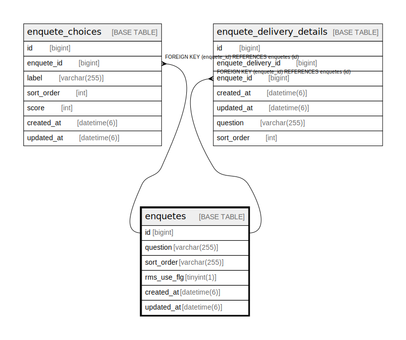

# enquetes

## Description

<details>
<summary><strong>Table Definition</strong></summary>

```sql
CREATE TABLE `enquetes` (
  `id` bigint NOT NULL AUTO_INCREMENT,
  `question` varchar(255) COLLATE utf8mb4_bin NOT NULL,
  `sort_order` varchar(255) COLLATE utf8mb4_bin NOT NULL,
  `rms_use_flg` tinyint(1) NOT NULL DEFAULT '0',
  `created_at` datetime(6) NOT NULL,
  `updated_at` datetime(6) NOT NULL,
  PRIMARY KEY (`id`)
) ENGINE=InnoDB AUTO_INCREMENT=[Redacted by tbls] DEFAULT CHARSET=utf8mb4 COLLATE=utf8mb4_bin
```

</details>

## Columns

| Name | Type | Default | Nullable | Extra Definition | Children | Parents | Comment |
| ---- | ---- | ------- | -------- | ---------------- | -------- | ------- | ------- |
| id | bigint |  | false | auto_increment | [enquete_choices](enquete_choices.md) [enquete_delivery_details](enquete_delivery_details.md) |  |  |
| question | varchar(255) |  | false |  |  |  |  |
| sort_order | varchar(255) |  | false |  |  |  |  |
| rms_use_flg | tinyint(1) | 0 | false |  |  |  |  |
| created_at | datetime(6) |  | false |  |  |  |  |
| updated_at | datetime(6) |  | false |  |  |  |  |

## Constraints

| Name | Type | Definition |
| ---- | ---- | ---------- |
| PRIMARY | PRIMARY KEY | PRIMARY KEY (id) |

## Indexes

| Name | Definition |
| ---- | ---------- |
| PRIMARY | PRIMARY KEY (id) USING BTREE |

## Relations



---

> Generated by [tbls](https://github.com/k1LoW/tbls)
