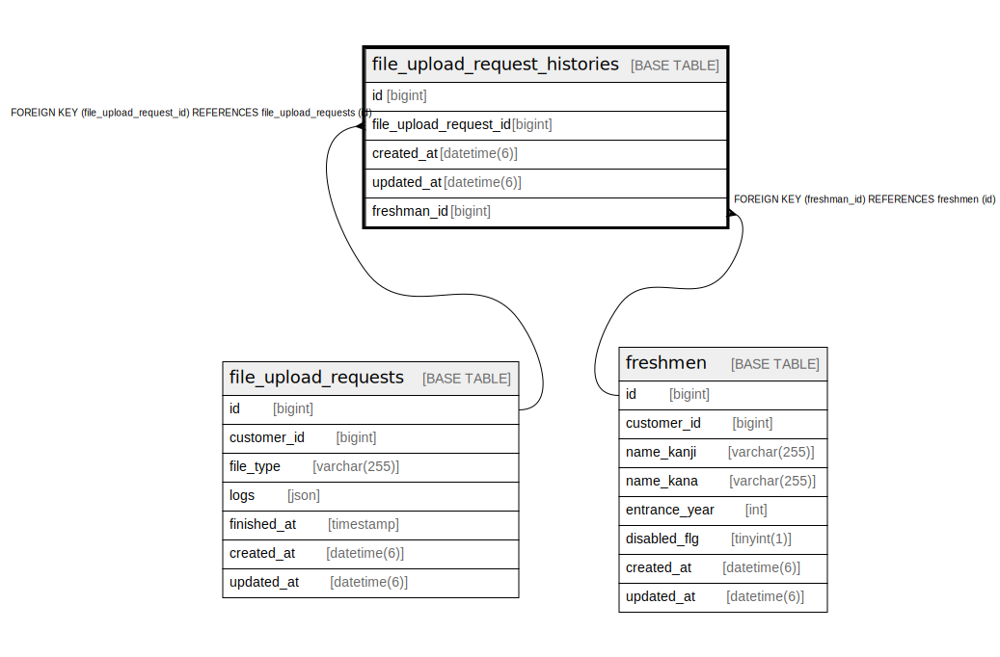

# file_upload_request_histories

## Description

<details>
<summary><strong>Table Definition</strong></summary>

```sql
CREATE TABLE `file_upload_request_histories` (
  `id` bigint NOT NULL AUTO_INCREMENT,
  `file_upload_request_id` bigint NOT NULL,
  `created_at` datetime(6) NOT NULL,
  `updated_at` datetime(6) NOT NULL,
  `freshman_id` bigint NOT NULL,
  PRIMARY KEY (`id`),
  KEY `index_file_upload_request_histories_on_file_upload_request_id` (`file_upload_request_id`),
  KEY `index_file_upload_request_histories_on_freshman_id` (`freshman_id`),
  CONSTRAINT `fk_rails_50e2dea200` FOREIGN KEY (`freshman_id`) REFERENCES `freshmen` (`id`),
  CONSTRAINT `fk_rails_e8df06b304` FOREIGN KEY (`file_upload_request_id`) REFERENCES `file_upload_requests` (`id`)
) ENGINE=InnoDB AUTO_INCREMENT=[Redacted by tbls] DEFAULT CHARSET=utf8mb4 COLLATE=utf8mb4_bin
```

</details>

## Columns

| Name | Type | Default | Nullable | Extra Definition | Children | Parents | Comment |
| ---- | ---- | ------- | -------- | ---------------- | -------- | ------- | ------- |
| id | bigint |  | false | auto_increment |  |  |  |
| file_upload_request_id | bigint |  | false |  |  | [file_upload_requests](file_upload_requests.md) |  |
| created_at | datetime(6) |  | false |  |  |  |  |
| updated_at | datetime(6) |  | false |  |  |  |  |
| freshman_id | bigint |  | false |  |  | [freshmen](freshmen.md) |  |

## Constraints

| Name | Type | Definition |
| ---- | ---- | ---------- |
| fk_rails_50e2dea200 | FOREIGN KEY | FOREIGN KEY (freshman_id) REFERENCES freshmen (id) |
| fk_rails_e8df06b304 | FOREIGN KEY | FOREIGN KEY (file_upload_request_id) REFERENCES file_upload_requests (id) |
| PRIMARY | PRIMARY KEY | PRIMARY KEY (id) |

## Indexes

| Name | Definition |
| ---- | ---------- |
| index_file_upload_request_histories_on_file_upload_request_id | KEY index_file_upload_request_histories_on_file_upload_request_id (file_upload_request_id) USING BTREE |
| index_file_upload_request_histories_on_freshman_id | KEY index_file_upload_request_histories_on_freshman_id (freshman_id) USING BTREE |
| PRIMARY | PRIMARY KEY (id) USING BTREE |

## Relations



---

> Generated by [tbls](https://github.com/k1LoW/tbls)
