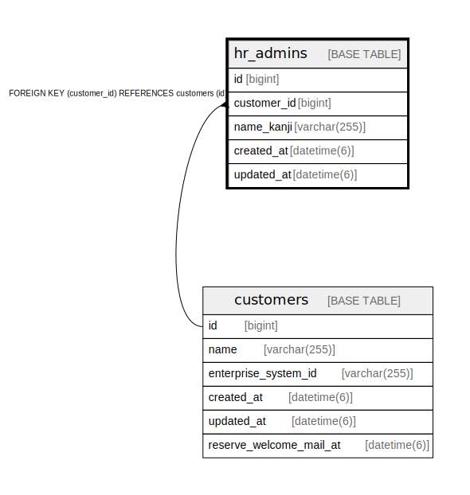

# hr_admins

## Description

<details>
<summary><strong>Table Definition</strong></summary>

```sql
CREATE TABLE `hr_admins` (
  `id` bigint NOT NULL AUTO_INCREMENT,
  `customer_id` bigint NOT NULL,
  `name_kanji` varchar(255) COLLATE utf8mb4_bin NOT NULL,
  `created_at` datetime(6) NOT NULL,
  `updated_at` datetime(6) NOT NULL,
  PRIMARY KEY (`id`),
  KEY `index_hr_admins_on_customer_id` (`customer_id`),
  CONSTRAINT `fk_rails_6429847f85` FOREIGN KEY (`customer_id`) REFERENCES `customers` (`id`)
) ENGINE=InnoDB AUTO_INCREMENT=[Redacted by tbls] DEFAULT CHARSET=utf8mb4 COLLATE=utf8mb4_bin
```

</details>

## Columns

| Name | Type | Default | Nullable | Extra Definition | Children | Parents | Comment |
| ---- | ---- | ------- | -------- | ---------------- | -------- | ------- | ------- |
| id | bigint |  | false | auto_increment |  |  |  |
| customer_id | bigint |  | false |  |  | [customers](customers.md) |  |
| name_kanji | varchar(255) |  | false |  |  |  |  |
| created_at | datetime(6) |  | false |  |  |  |  |
| updated_at | datetime(6) |  | false |  |  |  |  |

## Constraints

| Name | Type | Definition |
| ---- | ---- | ---------- |
| fk_rails_6429847f85 | FOREIGN KEY | FOREIGN KEY (customer_id) REFERENCES customers (id) |
| PRIMARY | PRIMARY KEY | PRIMARY KEY (id) |

## Indexes

| Name | Definition |
| ---- | ---------- |
| index_hr_admins_on_customer_id | KEY index_hr_admins_on_customer_id (customer_id) USING BTREE |
| PRIMARY | PRIMARY KEY (id) USING BTREE |

## Relations



---

> Generated by [tbls](https://github.com/k1LoW/tbls)
